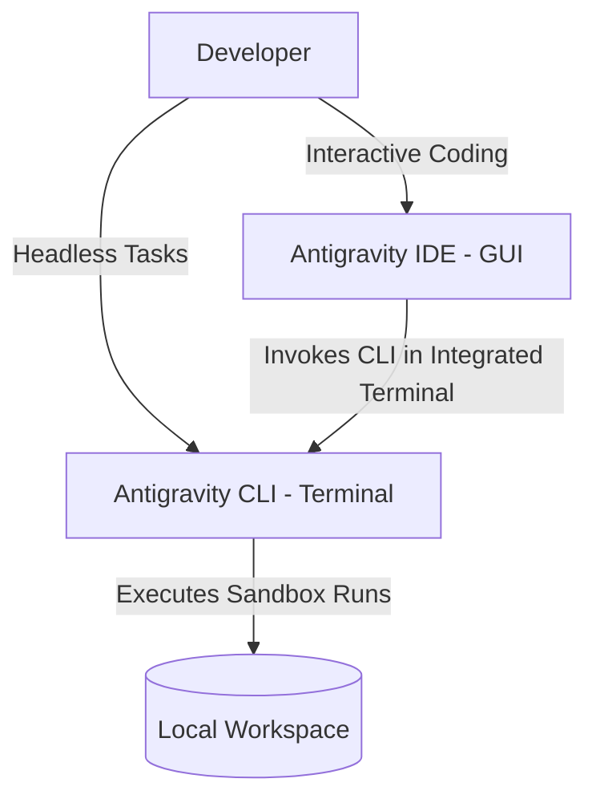

The landscape of AI-assisted software development is evolving rapidly. Developers are no longer restricted to simple autocomplete plugins; instead, they are deploying fully autonomous agents directly into their repositories. 

Among the leading systems is **Google Antigravity 2.0**, developed by the **Google DeepMind** team. However, as developers adopt this stack, a common question arises: **What is the difference between Google Antigravity (the CLI agent) and the Antigravity IDE?**

While both tools share the same underlying DeepMind AI models, they cater to entirely different developer workflows. This guide breaks down the core distinctions, details when to use each, and provides step-by-step, real-world tutorials for both environments.

---

## The Core Concept: Brain vs. Cockpit

To understand the relationship between these two tools, think of them as an engine and a vehicle:
*   **Antigravity (CLI / Agent)** is the **AI Brain**. It is a headless, goal-oriented software engineer that runs tasks autonomously in sandboxed environments, performing research, writing code, and correcting compiler errors.
*   **Antigravity IDE** is the **Cockpit**. It is a graphical integrated development environment (built on top of VSCodium/VS Code architectures) that embeds the Antigravity agent directly into a visual editor, complete with file trees, terminal panels, and inline chat overlays.



---

## CLI vs. IDE: High-Level Comparison

| Feature | Antigravity CLI (Agent) | Antigravity IDE (GUI) |
| :--- | :--- | :--- |
| **User Interface** | Headless CLI / Terminal | Full GUI Window / Editor |
| **Developer Interaction** | **Low-Frequency**: Provide goal $\rightarrow$ Agent executes $\rightarrow$ Accept PR. | **High-Frequency**: Real-time coding, tab completions, inline edits. |
| **Safety Measures** | Strict sandbox containers & directory-level permission gates. | Local file system reads, inline visual Diff review overlays. |
| **Best For** | Multi-file refactoring, test-driven bug fixes, dependency migrations. | Daily boilerplate creation, writing CSS, reviewing local code Diffs. |

---

## Deep Dive 1: Google Antigravity CLI (Headless Agent)

The CLI agent operates under a **Planning Paradigm**. Instead of typing code alongside you, you hand it a ticket or a refactoring goal, and it executes a closed loop of analysis, planning, writing, testing, and self-correcting.

### Real-World Scenario: Cross-Module API Refactoring
*   **Problem**: You have a core database service `UserService.ts` with a method `getUserData(id: string)`. You need to rename it to `fetchUserProfile(userId: string, options?: FetchOptions)` and restructure its return interface. This change will instantly break dozens of files calling this service across the project.

### Step-by-Step Tutorial:

#### Step 1: Initialize the Agent in Your Repository
Open your terminal in the root of your project directory and wake up the agent:
```bash
antigravity dev ./
```

#### Step 2: Set a Goal via the `/goal` Command
Provide the agent with a high-level goal and its acceptance criteria.
```text
/goal Rename getUserData to fetchUserProfile in UserService.ts. Add FetchOptions parameter, update all cascade imports and invocations across the project, and ensure 'npm run build' compiles with zero errors.
```

#### Step 3: Approve the `implementation_plan.md`
The agent parses your codebase's Abstract Syntax Tree (AST), maps the dependency call-graph, and generates a plan file (`implementation_plan.md`) listing all 12 affected files. Review the plan and approve it in the terminal:
```text
Plan looks solid. Start execution.
```

#### Step 4: Monitor `task.md` Execution
The agent initializes a dynamic task checklist (`task.md`) in your workspace, updating its progress dynamically:
*   `[x] Refactor signature in UserService.ts`
*   `[/] Cascade changes to UserController.ts (In Progress)`
*   `[ ] Run compiler check (Pending)`

#### Step 5: Sandbox Compilation & Self-Correction
While refactoring file #8, the agent misses a React component Prop type. Upon running `tsc --noEmit` in its isolated sandbox, it hits a TypeScript compiler error.
The CLI agent reads the compiler's stderr stream, pinpoints the line of code that failed, rewrites the React component using the correct prop interfaces, and re-compiles until the compiler returns zero errors.

#### Step 6: Verify and Merge
Review the final `walkthrough.md` generated by the agent. If you are satisfied with the surgical Diffs, accept the changes to merge them into your local branch.

---

## Deep Dive 2: Antigravity IDE (Graphical Workspace)

The IDE workspace integrates AI predictions directly into your keystrokes. It is designed for active, collaborative coding where you review every suggestion line-by-line.

### Real-World Scenario: Developing a Glassmorphism React Card
*   **Problem**: You need to quickly design and implement a modern UI dashboard metric card using React, TypeScript, and TailwindCSS with a frosted glass backdrop and hover micro-animations.

### Step-by-Step Tutorial:

#### Step 1: Open Your Workspace in the IDE
Launch the **Antigravity IDE** desktop application and import your frontend workspace.

#### Step 2: Use Predictive Autocomplete (Tab Completion)
Create a new file `components/MetricCard.tsx` and start typing:
```typescript
import React from 'react';
interface MetricCardProps {
```
The IDE will predict the rest of your interface and component structure in a ghost-text preview. Press **`Tab`** to accept the suggestion.

#### Step 3: Refine Styling Using Inline Chat
Highlight the outer `div` block of the card component, and press **`Cmd + I`** (macOS) or **`Ctrl + I`** (Windows) to open the inline chat input.
Type the following prompt:
```text
Apply a frosted glass effect (Glassmorphism) with an HSL gradient background, a subtle border-glow, and a hover transition that scales the card and shifts its shadow.
```
The editor will generate a line-by-line Diff view showing the tailwind utilities modification:
```diff
- className="border p-4 rounded"
+ className="backdrop-blur-md bg-white/10 border border-white/20 shadow-xl transition-all duration-300 hover:-translate-y-1 hover:bg-white/15"
```
Click **Accept** to apply the styling inline.

#### Step 4: Extend Architecture via the AI Side Panel
To connect this static card to a React Context, press **`Cmd + L`** to open the AI Chat side panel. Drag your `MetricCard.tsx` file into the chat context and type:
```text
I want to feed data to this MetricCard from a SystemMonitorContext. Generate the context provider and explain how to wrap it around my dashboard layout.
```
Copy the generated Context Provider code, and use the **"Apply to Editor"** button to inject it directly into your layout codebase.

---

## The Ultimate Developer Workflow: Combining Both Tools

The most productive developers do not choose between the CLI agent and the IDE; they use them together.

By running **Antigravity CLI inside the integrated terminal of the Antigravity IDE**, you achieve a unified workflow:
1.  **Draft and Design**: Build UI components and write daily business logic in the IDE, using Tab completions for high-speed coding.
2.  **Delegate Large Tasks**: When you need to rename a widely used data interface or migrate database models, trigger the CLI agent (`antigravity dev ./`) inside the IDE's terminal panel.
3.  **Review Seamlessly**: Let the CLI agent run in the background. When it generates the `implementation_plan.md` and Diffs, you can open and edit them directly in the IDE editor window.
4.  **Ship Safe Code**: Once the sandbox compiler returns a green light, your IDE’s Git panel will display a clean, error-free changeset ready for code review and production deployment.
