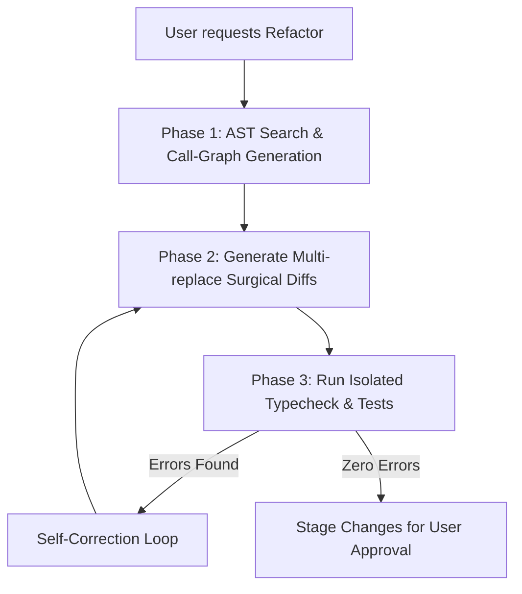

Every developer knows the pain of large-scale refactoring. Changing a core interface signature, renaming a widely used utility parameter, or splitting a component often requires manual edits across dozens of files. 

If a human engineer can easily miss a cascade file change, how does an autonomous AI agent handle it?

With **Google Antigravity 2.0**, the agent relies on Abstract Syntax Tree (AST) analysis combined with compiled feedback loops to perform complex, multi-file refactorings safely. In this post, we breakdown the technical mechanics behind this process.

---

## The Challenge: Cascading Breaks

When an LLM attempts to refactor code, a naive search-and-replace strategy fails. For example, renaming a function `getUserData(id)` to `fetchUser(userId, options)` breaks:
1. Every file that imports the function.
2. The argument passing format (which now expects two parameters).
3. The TypeScript types or parameters mapping.

If the agent only modifies the source file, the build breaks immediately. 

---

## How Antigravity 2.0 Performs Multi-File Edits

Antigravity uses a three-phase execution model for transactional refactorings: **Analyze, Propose, and Validate**.

### Phase 1: AST Search & Call-Graph Mapping
Before writing a single line of code, Antigravity generates a local call-graph.
* **AST Parsing**: Instead of doing text-based grepping, it parses the codebase into an Abstract Syntax Tree (AST).
* **Dependency Resolution**: It traces where the target function, class, or module is imported and invoked across the workspace. This outputs a precise list of files that require modification.

### Phase 2: Generating Surgical Diffs
Once the target files are identified, the agent uses a specialized tool (`multi_replace_file_content`) to target non-contiguous lines.
* **Precise Replacements**: Instead of rewriting whole files (which is expensive and prone to context loss), it replaces specific lines matching the AST node changes.
* **Batch Operations**: It queues the replacements across multiple files simultaneously, preparing them as a single logical transaction.

### Phase 3: The Compiler Loop (Validation)
Once the changes are staged in the virtual workspace, Antigravity immediately triggers compiler checks:
* **Static Analysis**: For TypeScript/Next.js, it runs typecheck checks (`tsc --noEmit`). For Python, it runs static linters.
* **Error Log Parsing**: If compiler errors appear, the agent does not quit. It parses the line numbers and error logs from the compiler output, feeds them back into its context, and performs a second-pass fix (the self-correction loop).

---

## Sandbox Isolation: Safe Rolling Back

What happens if a complex refactoring goes horribly wrong? 

Because Antigravity executes all file modifications in a virtualized branch workspace:
* **Zero Damage**: Your main staging branch remains completely clean.
* **Atomic Rollback**: If a refactoring cannot resolve its compile errors within a set number of iterations, the agent rolls back the entire transaction instantly. 

This fail-safe architecture ensures you never inherit a half-broken codebase.

---

*In our next post, we will explore how Antigravity handles background execution by orchestrating specialized subagents. Stay tuned for Day 2!*
