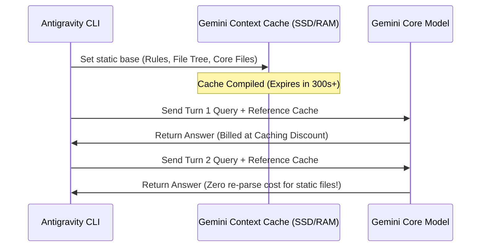

If you have ever run an autonomous AI agent over a large codebase for several hours, you are probably familiar with **token shock**. 

Because agents need to continually read files, remember system rules, and parse compiler outputs, the input context grows exponentially with each turn of the conversation. In a large repository, a single simple bug-fixing task can consume millions of tokens, leading to high API bills.

To keep AI-native engineering affordable, **Google Antigravity 2.0** leverages one of Gemini's most powerful native API features: **Context Caching** (also known as Prompt Caching).

Let's dissect how this technology slashes agentic development costs by up to 90%.

---

## The Problem: The Exponential Context Tax

In a typical multi-turn agent conversation, the agent's input context looks like this:

```
Turn 1: [System Rules + Codebase Directory + File A] -> Agent Response
Turn 2: [System Rules + Codebase Directory + File A] + [File B + Compile Logs] -> Agent Response
Turn 3: [System Rules + Codebase Directory + File A + File B + Compile Logs] + [Test Run Outputs] -> Agent Response
```

As the dialogue progresses, the static files (System Rules, Directory structure, unchanged codebase files) are **re-sent and re-processed** by the model on every single turn. You are billed full price for reading the exact same files repeatedly.

---

## The Solution: Gemini Context Caching

Gemini's **Context Caching** allows the API to cache a large, static block of tokens (minimum 32k tokens) in memory. When subsequent API requests are made, the model references the pre-compiled cache rather than processing the files from scratch.



### The Cost Savings Breakdown
By caching the static codebase context:
* **Input Token Pricing**: Reading cached tokens is priced at a **substantial discount** compared to fresh input tokens (often cutting input costs by 50% to 90% depending on cache hits).
* **Processing Latency**: Because the model doesn't need to re-parse millions of characters of source code on every message, Time-to-First-Token (TTFT) drops from seconds to milliseconds.

---

## How Antigravity 2.0 Manages the Cache

Antigravity optimizes the cache lifecycle automatically under the hood:

1. **Warmup Phase**: On launch, the CLI calculates the token size of your project's index, folder structures, and active rules. If it exceeds 32k tokens, it registers a new Gemini API Context Cache with a default Time-To-Live (TTL) of 300 seconds.
2. **TTL Auto-Renewal**: Every time you send a new command or the compiler outputs logs, Antigravity sends the delta while automatically pinging the API to extend the cache's TTL.
3. **Cache Eviction**: When you close the terminal or go idle for more than 5 minutes, the cache expires automatically, ensuring no stale tokens linger or inflate storage costs.

---

## Conclusion: Making Agents Practical

Context caching shifts autonomous programming from a costly experiment to a practical daily tool. By minimizing repetitive token processing, Antigravity 2.0 allows you to run hours of autonomous coding, testing, and debugging loops for less than the cost of a cup of coffee.

---

*On Day 5, we will look at how Antigravity automates its own code validation by running a closed-loop Test-Driven Development (TDD) process inside sandboxes.*
