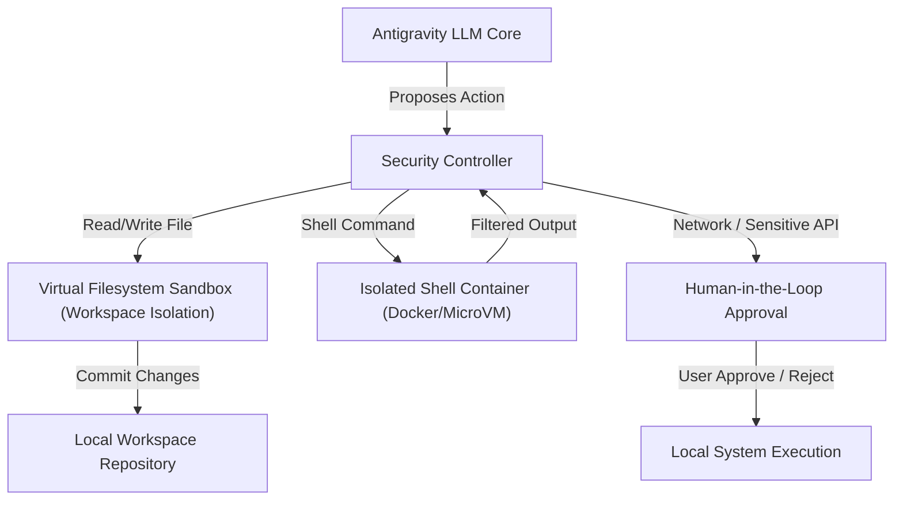

Autonomous coding agents are incredibly powerful, but they present a massive security challenge: **How do you safely allow an LLM to run bash commands and edit files directly on your local machine?** 

A single hallucinated regex replacement or an unvetted script download could destroy your operating system or compromise sensitive environment keys. 

To solve this, Google Antigravity 2.0 implements a **Zero-Trust Sandbox Architecture**. In this article, we deep-dive into how it isolates file modifications, executes shell commands under human guardrails, and mitigates agentic security risks.

---

## 1. The Core Threat Model of Autonomous Agents
When you run a command-line AI agent (like Claude Code, AutoGPT, or Antigravity), you grant it access to tools that can:
1. **Read files** (potential credential leakage)
2. **Write files** (malicious code injection)
3. **Execute terminal shell commands** (arbitrary code execution)

If the model hallucinates or is fed a prompt-injection attack, it might attempt to run destructive commands like `rm -rf /` or leak `.env` keys to external URLs.

---

## 2. Antigravity's Defense Line: The Sandbox Architecture

Antigravity 2.0 separates agent reasoning from local execution using a layered defense model:

### Layer 1: Isolated Workspaces (Git-based Shadowing)
When Antigravity starts a task, it doesn't edit your production files directly. It operates in a **shadow workspace** (similar to a Git worktree or Mercurial share). 
* **Branch Isolation**: The agent performs all edits on a dedicated virtual branch.
* **Diff Stage**: File edits are staged as code diffs. Only when the task is marked as "Verified" and approved by the user are the files merged back into your active working directory.

### Layer 2: The Command Gatekeeper (Human-in-the-Loop)
Unlike older agent models that blindly run bash scripts, Antigravity 2.0 routes all command proposals through a terminal supervisor.
* **Categorized Command Risks**: Safe commands (e.g. `git status`, `npm run build`) can run within the sandbox, but modifications, dependency installations (`npm i`, `pip install`), or network requests (`curl`, `wget`) require explicit developer confirmation.
* **Non-Interactive Execution**: If a background command hangs or prompts for password access, the gatekeeper suspends the task and waits for manual user input.

### Layer 3: Network Sandboxing & API Whitelisting
Antigravity CLI restricts outgoing HTTP requests. By default:
* The agent cannot query arbitrary external domains unless the domain is explicitly whitelisted in the user's configurations.
* Retrieval plugins (like PubChem, UniProt, or PubMed integrations) execute through a secure MCP proxy, keeping your local token credentials completely hidden from the LLM.

---

## 3. Subagent Permission Delegation

One of the most advanced features of Antigravity 2.0 is **Subagent Delegation**. When the parent agent spawns a helper subagent to research code or run test suites:
1. **Inherited Scopes**: The subagent inherits a strict subset of the parent's read/write permissions.
2. **No Escalation**: A subagent cannot request higher permissions than its parent.
3. **Isolated Threading**: Subagents execute in isolated threads, preventing one subagent from reading the temporary cache files or memory contexts of another.

---

## 4. Best Practices for Developers
Even with a zero-trust sandbox, developers should practice defense-in-depth when running command-line agents:

* **Use Docker or VM Environments**: Run the Antigravity CLI within a dedicated development Docker container.
* **Keep Secrets Out of Workspaces**: Never store raw `.env` secret keys or private SSH keys directly inside the project directory the agent is analyzing. Use environment managers or secret vaults instead.
* **Review Diff Blocks**: Do not blindly press "Approve All" when the agent generates an implementation plan. Review the surgical diff chunks in the terminal.

---

*Want to start building safely? Check out our [Google Antigravity 2.0 Tutorial Guide](/blog/google-antigravity-tutorial-guide) to set up your secure workspace configuration.*
