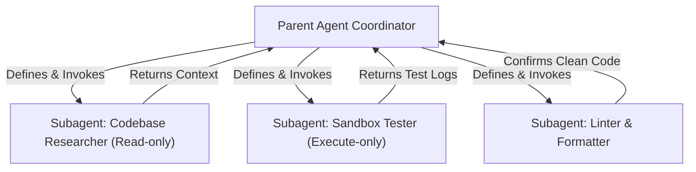

As software projects grow in scale, single-agent LLM systems hit a hard ceiling: **the context window bottleneck**. 

If a single AI agent has to search a database, read file structures, compile logs, write code, and analyze tests all in one thread, its context gets cluttered. This leads to high token costs, slower responses, and a high rate of logical errors.

**Google Antigravity 2.0** solves this by implementing a **Multi-Agent Orchestration Architecture**. By spawning specialized subagents, the parent coordinator delegates tasks and runs background research threads concurrently. 

Here is how it works under the hood.

---

## The Architecture: Coordinator & Specialized Workers

Instead of being a monolith, Antigravity 2.0 operates as an orchestrator. When faced with a complex task, the parent agent spins up dedicated subagents via two core mechanisms: `define_subagent` and `invoke_subagent`.



Each subagent has:
* **Specific System Prompt**: Tailored instructions specifying its role (e.g., Codebase Researcher, Database Auditor).
* **Restricted Tools**: A researcher might only have read tools, while a debugger has terminal and execution tools.
* **Independent Context**: The subagent only sees the specific prompt it was assigned, avoiding context pollution for the parent.

---

## Defining & Spawning Subagents

In the Antigravity workspace, defining a new subagent requires specifying its scope, capabilities, and workspace modes. The parent agent configures these variables dynamically:

```ts
// Example definition of a subagent
await defineSubagent({
  name: "DatabaseDebugger",
  description: "Learn how Google Antigravity 2.0 coordinates specialized subagents to tackle complex repository research and automated testing tasks in parallel.",
  enable_write_tools: true, // Restricted to DB migrations and test directories
  system_prompt: "You are a database debugger. Focus purely on diagnosing query performance..."
});
```

Once defined, the subagent can be invoked concurrently. For instance, while the parent is outlining the implementation plan, it can trigger a `DatabaseDebugger` and a `FrontendLinter` to run in the background.

---

## Parallel Execution & Reactive Communication

How do these agents communicate without blocking the system or spamming the user?

1. **Non-Blocking Execution**: Subagents run asynchronously in background threads. The parent agent doesn't sit idle waiting in a loop. It continues with other work.
2. **Reactive Wakeup**: When a subagent completes its task or needs guidance, it uses the `send_message` tool to signal the parent. The parent agent is instantly woken up by a high-priority system notification containing the subagent's payload.
3. **Workspace Modes**: Subagents can run in three isolated workspace modes:
   * `inherit`: Shares the parent's repository workspace directory.
   * `branch`: Creates an isolated Git branch of the codebase.
   * `share`: Operates in a shared git worktree configuration to allow independent changes without duplicating storage.

---

## Summary: Scaling AI Labor

By partitioning labor into isolated threads, Antigravity 2.0 achieves what monolithic agents cannot: **structured, parallel software engineering**. The parent coordinator acts as a manager, synthesizing findings and making final code integrations, while specialized subagents do the heavy lifting in parallel.

---

*In Day 3, we will shift focus to extending Antigravity's capabilities by building a custom Model Context Protocol (MCP) server.*
