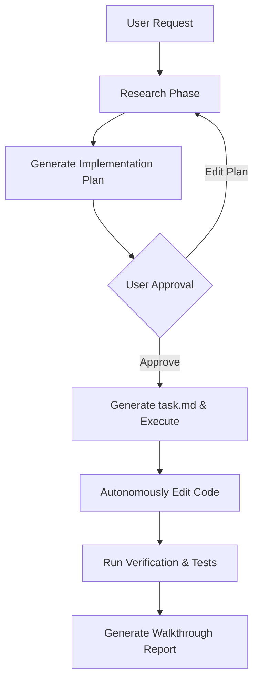

# Google Antigravity 2.0: The Ultimate Autonomous AI Coding Agent by Google DeepMind

The landscape of modern software engineering is shifting rapidly. Over the past few years, developers have transitioned from writing code manually to relying heavily on AI completion tools. However, passive autocomplete widgets and simple chat sidebars are no longer sufficient. 

Today, we are thrilled to introduce **Google Antigravity 2.0**, a state-of-the-art **autonomous AI coding agent** developed by the **Google DeepMind** team. As the next-gen **AI agentic coding assistant**, Google Antigravity 2.0 represents a monumental leap forward—moving from a simple code generator to a fully autonomous software developer partner that integrates directly with your local workspace.

---

## Why Google Antigravity 2.0 is the Best AI Agentic Coding Assistant

Most first-generation AI coding tools work on a simple request-and-response model: you highlight some code, ask a question, and copy-paste the output. 

**Google Antigravity 2.0** redefines this flow. It acts as an **autonomous AI developer** that operates directly on your local filesystem. By combining advanced reasoning models from Google DeepMind with localized system toolsets, Antigravity behaves like an experienced software engineer sitting next to you. It plans architectural changes, manages progress, edits multiple non-adjacent files, and compiles/tests code to verify correctness—all within a highly secure local workspace. It has quickly become the leading **Cursor alternative** and **Claude Code alternative** for teams looking for end-to-end development automation.

---

## Key Pillars of the Antigravity AI Coding Agent

### 1. Advanced Planning & Execution Tracking
When handed a complex coding prompt, the **Antigravity AI agent** does not jump straight into modifying code. Instead, it enters a structured **Planning Mode**, splitting its workflow into formal, verifiable phases:

* **Research**: The agent reads workspace files, analyzes configurations, and maps out dependencies to fully understand the project context.
* **Design & Approval**: It generates a detailed `implementation_plan.md` outline highlighting proposed modifications, potential side-effects, and open questions. The agent pauses here, requesting your explicit feedback.
* **Progress Tracking**: Once approved, Antigravity creates a dynamic `task.md` file (a markdown TODO list). It marks tasks as `[/]` (in progress) or `[x]` (completed) as it modifies the codebase, keeping you informed at every step.
* **Self-Verification**: Finally, it compiles your code, runs unit tests, and compiles a `walkthrough.md` report showing exactly what was changed and verified.

Here is an illustration of this **autonomous AI developer** workflow:



### 2. Multi-Agent Orchestration & Subagent Delegation
Large refactoring tasks often involve concurrent subtasks, such as running background research, searching docs, or writing tests. The **Google Antigravity 2.0** framework solves context-bloat through **Subagent Delegation**. 

From a single prompt, the main agent can define and spawn independent background subagents:
```javascript
// Example of how subagents are defined and invoked programmatically
const researchAgent = await agent.defineSubagent({
  name: 'Codebase Researcher',
  role: 'Deep Code Explorer',
  prompt: 'Analyze current routing in src/app/categories and report back'
});

await researchAgent.invoke();
```
These subagents execute tasks concurrently, returning clean summaries directly into the main agent's context without cluttering the primary development workspace.

### 3. Surgical Diff & Precision Code Replacement (Chunk Engine)
Standard LLM code editors often try to rewrite entire files to make small changes. This wastes tokens, slows down performance, and risks erasing valuable inline documentation or comments.

Antigravity 2.0 utilizes a **Chunk-Based Replacement Engine** (`multi_replace_file_content`). It targets exact line ranges using unique substrings and inserts modifications with surgical precision:

```diff
<<<< TARGET CONTENT
export function Header() {
  const [activeHref, setActiveHref] = useState('/')
==== REPLACEMENT CONTENT
export function Header() {
  const pathname = usePathname()
  const isActive = (href) => pathname === href
>>>>
```
This guarantees that your comments, custom formatting, and surrounding functions remain completely untouched.

### 4. Zero-Trust Sandbox Environment
Enabling an AI to execute terminal commands on your system raises natural security questions. Google Antigravity 2.0 integrates a robust **Hierarchical Permission Gate**. 

Every terminal execution, package installation, or external API call is run within an isolated container. If an operation requires elevated access (such as writing to system directories, accessing networks, or editing configuration files), the agent halts and prompts the developer for explicit, one-time permission.

---

## Antigravity 2.0 vs. The Competition: The Ultimate Comparison

How does Google Antigravity 2.0 compare to other coding solutions like Cursor, Windsurf, or Claude Code?

| Feature | Cursor / Windsurf | Claude Code | Google Antigravity 2.0 |
| :--- | :--- | :--- | :--- |
| **Interface** | IDE / GUI | CLI / Terminal | CLI & Dynamic Workspace |
| **Planning Paradigm** | Inline Chat | Conversational | Formal Plans (`implementation_plan.md`) |
| **Subagent Concurrency** | No | No | Yes (spawns background subagents) |
| **Safety Sandbox** | Host-level execution | Host-level execution | Sandboxed container execution |
| **Command Permission** | Automated / Implicit | Implicit | Strict Hierarchical Gate |
| **Primary Focus** | Code completion & chat | Interactive terminal help | Autonomous software engineering |

---

## Getting Started with the DeepMind Coding Agent

To start pairing with this powerful **AI pair programmer** in your local directory, you can invoke the CLI command:

```bash
antigravity dev ./
```

You can then issue commands like:
- `/goal` : Run a long, autonomous session (e.g. overnight refactoring) where the agent won't stop until it meets a defined criterion.
- `/schedule` : Schedule recurring codebase health checks, sitemap audits, or automated PR validations.

---

## Conclusion: The Future of Autonomous Software Engineering

Google Antigravity 2.0 is more than just an autocomplete assistant—it represents the future of autonomous software engineering. By handling the tedious processes of planning, executing, and testing, it frees up developers to focus on what matters most: high-level architecture, design, and product strategy.

If you are searching for the best **Cursor alternative** or looking to deploy the ultimate **autonomous AI coding agent** on your codebase, Antigravity 2.0 is the definitive tool. 

Check out our dedicated [Google Antigravity Tool Page](/tools/google-antigravity) to learn more about its commands, features, pricing, and integration steps!
